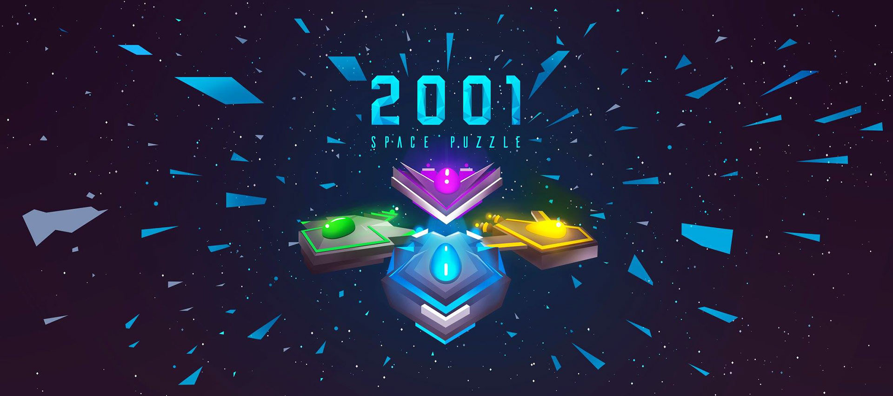
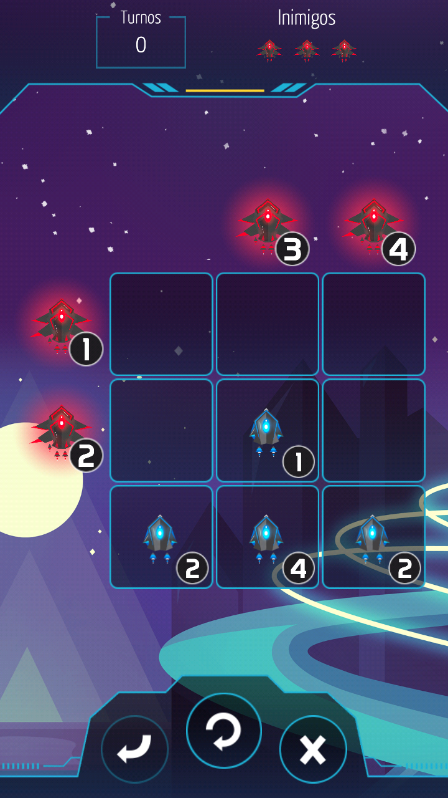
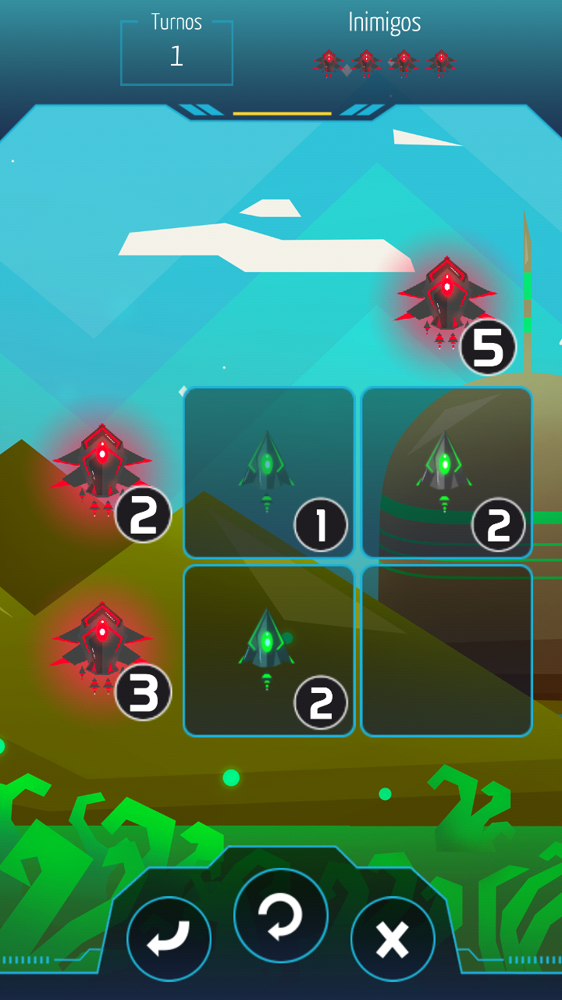
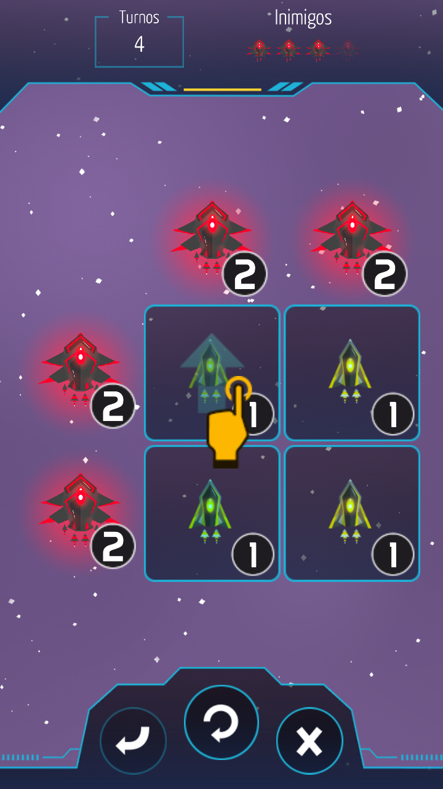
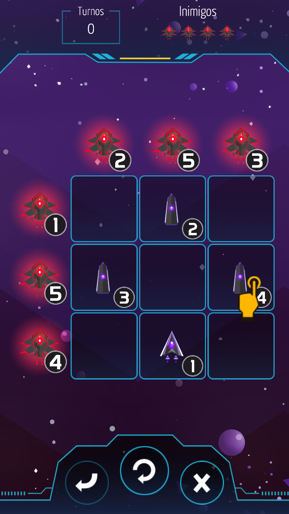

## 2001: Space Puzzle

A sliding puzzle game inspired by Sokoban and Kakuro. To win, players must match the values of ally and enemy ships on both lines and columns. There are multiple obstacles that may appear in the grid, and four types of ships, each one with different properties. 

### Trailer

<iframe src='https://www.youtube.com/embed//-sThnOeglHI' frameborder='0' allowfullscreen></iframe>

 

### Play the Game

The game was released in 2016 for iOS and Android. It reached organically an audience of over 1000 downloads and maintained a review score of 4.6.

- [Browser](https://arthursb.itch.io/2001-space-puzzle-demo)
- [Android](https://play.google.com/store/apps/details?id=com.AdvanceGames.DeltaFormation)
- [iOS](https://apps.apple.com/app/2001-spacepuzzle/id1142691434)

### Reception

Links below are in Portuguese, as the game was marketed for a local audience.

- [Game Reporter](https://gamereporter.uol.com.br/space-puzzle/)
- [Games4u](https://www.games4u.com/sc/br/g4u/jogo/2001-space-puzzle/03df473bead38f6a2ab5d3000c686d55j9pl3l02/)
- [OPovo](http://blogs.opovo.com.br/layout/2017/09/14/advance-conquista-short-list-do-sbgames/)

### Screenshots

