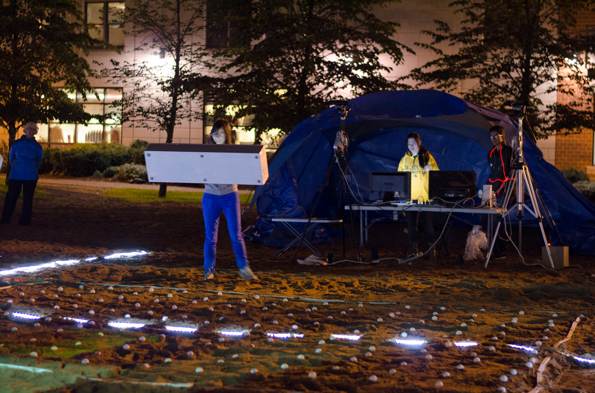

# Beach Pong

## About the project

A game to investigate dividing attention between virtual gameplay elements and the real world. It remixes mechanics from the classic game Pong. 

Players were given foam paddles embedded with tablets to act as their viewport. They physically moved around a sand court to make their virtual paddles move. Multiple Kinects tracked player positions and mapped them in the virtual world. 

The court was decorated with a LED grid that blinked to represent where the ball is in the virtual world. The grid also served as serve as visual cue for the limits of player movement.

## My contributions

- Core gameplay and design
- Integration of devices, such as the Kinect
- Supervise gameplay during the presentation event
- Write research papers

## Results

Beach Pong was exhibited in an art event called [Nocturne](https://nocturnehalifax.ca). It managed to catch the attention of nearby walkers and create huge lines of people who wanted to play. The experiment also led to two research papers.

## References

- [Dr. Reilly's personal page](https://web.cs.dal.ca/~reilly/Nocturne2014.html)
- [GEM Lab's project page](https://gem.cs.dal.ca/projects/beach-pong/)
- [Dal News](https://www.dal.ca/news/2014/10/16/pong--all-night-long--dal-cs-brings-classic-video-game-to-the-be.html)
- [The Coast](https://www.thecoast.ca/halifax/nocturne-by-the-hour/Content?oid=4438362)

## Media


../images/beachpong_3.jpg
../images/beachpong_4.jpg
../images/beachpong_8.jpg





