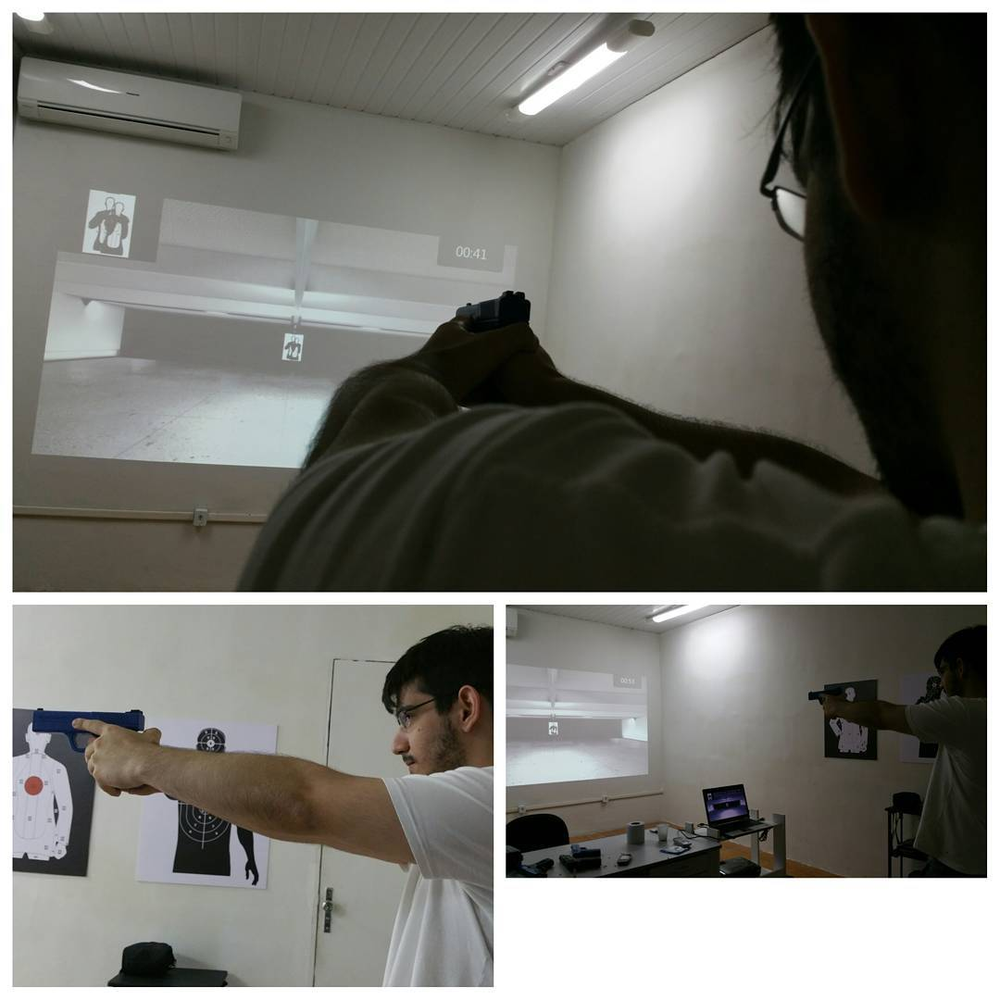

# Xtreme Shooting Simulator (XSS)

## About the project

A budget shooting simulator designed for training the local police. 

It employs the PS Eye camera with a red filter to detect lasers fired by custom 3D-printed "bullets".
The bullets were used with airsoft guns. Check the video in the Media section for more details.

## My contributions

- Maintenance: updates and bug fixes
- Improve user interface based on user feedback
- Add new features for the video-based training

## Results

Hundreds of police offices were training with the first version of the simulator. 

With the success in the local market, the company moved to Portugal, where it is operating to this day. The simulator is now called [EasyAim](http://easyaimsimulator.com/en/). 

## References

- [Crearetech on Facebook](https://www.facebook.com/crearetech/)
- [Eusebio's Official Website](http://eusebio.ce.gov.br/guarda-municipal-e-a-primeira-do-pais-a-utilizar-o-simulador-xtreme-nos-treinamentos/)
- [Maracanau's Official Website](https://www.maracanau.ce.gov.br/guarda-municipal-de-maracanau-utiliza-simulador-de-tiro/)

## Media


../images/xss_1.jpg
../images/xss_2.jpg
../images/xss_3.jpg



    <iframe src="https://www.facebook.com/plugins/video.php?height=314&href=https%3A%2F%2Fwww.facebook.com%2Fxssimulator%2Fvideos%2F1111460782209889%2F&show_text=false&width=560&t=0" width="560" height="314" style="border:none;overflow:hidden" scrolling="no" frameborder="0" allowfullscreen="true" allow="autoplay; clipboard-write; encrypted-media; picture-in-picture; web-share" allowFullScreen="true"></iframe>

