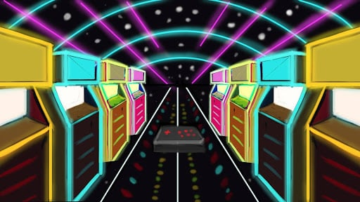

# Synesthesia

## About the project

A mixed reality game I developed as my final project to achieve my Bachelor's degree. It employed multiple learnings from [Beach Pong](https://arthursb.github.io/projects/2014-beachpong).

It is a runner game where players move sideways, jump and crouch using the Kinect to avoid obstacles in the virtual world. 

Other elements include LED lights synced with the soundtrack that helped delimiting the limits of body tracking and enhancing immersion.

## My contributions

- Leading a team of artists, sound designers and fellow developers
- Level design and programming
- Visual effects, both in-game and real-life
- Research and presentation

## Results

Achieved my Bachelor's degrees thanks to the game's quality and rich research results about immersion in games.

The research won a [Best Paper Award](http://usuarios.upf.br/~rieder/svr2017/awards.html) in 2017.

## References

- [Crearetech on Facebook](https://www.facebook.com/crearetech/)
- [Eusebio's Official Website](http://eusebio.ce.gov.br/guarda-municipal-e-a-primeira-do-pais-a-utilizar-o-simulador-xtreme-nos-treinamentos/)
- [Maracanau's Official Website](https://www.maracanau.ce.gov.br/guarda-municipal-de-maracanau-utiliza-simulador-de-tiro/)

## Media


../images/synesthesia.png
../images/synesthesia_1.jpg
../images/synesthesia_2.jpg






