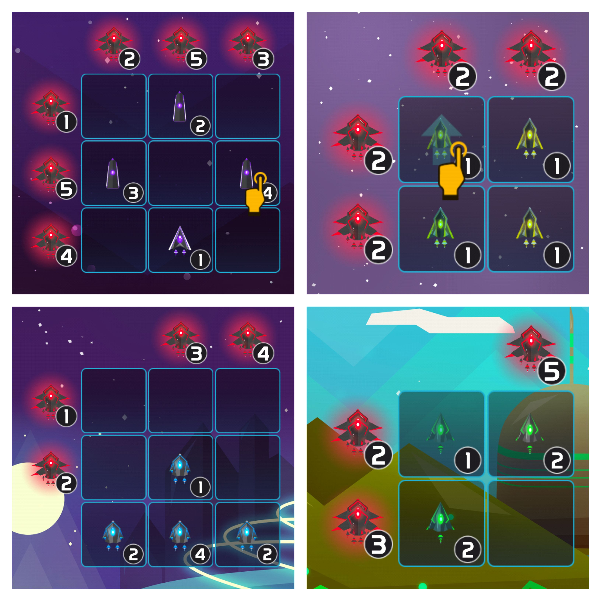

# 2001: Space Puzzle



## About the project

2001: Space Puzzle is a sliding puzzle game inspired by Sokoban and Kakuro. To win, players must match the values of ally and enemy ships on both lines and columns. Features include: different obstacles that may appear in the grid, four types of ships, each one with different properties, and a custom level creator.

Legacy apk build versions have been preserved by [APKPure](https://apkpure.com/2001-space-puzzle/com.AdvanceGames.DeltaFormation/versions).

## My contributions

- Brainstorm features
- Help with gameplay programming and bug fixing
- Integrate Unity code with native mobile plugins, such as AdSense and Analytics
- Help the main game designer create levels following a different creative approach 
- Monitor customer feedback and post-launch issues
- Maintain the stores pages and study how to reach a broader audience

## Results

The game was released in 2016 for iOS and Android and was maintained up to 2017. It reached organically an audience of over 1000 downloads and maintained a review score of 4.6 before getting delisted.

## References

- [Advance Comunicação](https://www.advance.com.br/en/works/jogo-2001-space-puzzle-advance-games/)
- [Game Reporter](https://gamereporter.uol.com.br/space-puzzle/)
- [Games4u](https://www.games4u.com/sc/br/g4u/jogo/2001-space-puzzle/03df473bead38f6a2ab5d3000c686d55j9pl3l02/)
- [OPovo](http://blogs.opovo.com.br/layout/2017/09/14/advance-conquista-short-list-do-sbgames/)

## Media


