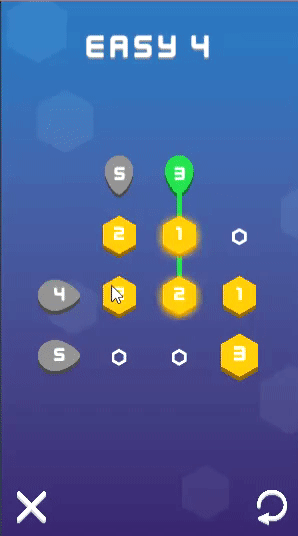

# Advance Games



## About the project

A series of short, casual, free minimalistic puzzle games with clever mechanics developed to showcase the team's ability in game development. 

## My contributions

- Level design
- User interface and experience implementation
- Gameplay programming
- WebGL publishing

## SumSet Classic

Move pieces to align the hexagons in a way such that the values match each row and column.



## SumSet Slider

A variation of the original gameplay employing extra sliding and teleporting mechanics.



## TraceRT

Create a path that guides the ship to collect all items and reach the goal.

