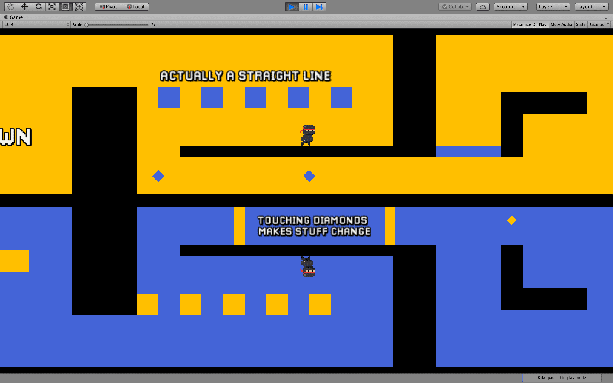

# Downside Up





## About the project

Downside Up is my Master's degree research project. I studied how data visualization supports level design.

The game is a hardcore 2D platformer in which players must guide a character through two mirrored screens. Objects may appear in only one of those screens, besides existing in both, so players must use their gaze to understand and overcome challenges. I improved this prototype using games user research methods and Data Visualization.

In this project I learned about designing games based on analytics. You can check more details about the research and multiple prototype versions in the [project's page on Github](https://arthursb.github.io/Downside-Up/).

## My contributions

- Level design and programming
- User research and documentation
- Implement data visualization and metrics capture
- Write and present paper

## Media


../images/downsideup_1.png
../images/downsideup_2.png
../images/downsideup_3.png




