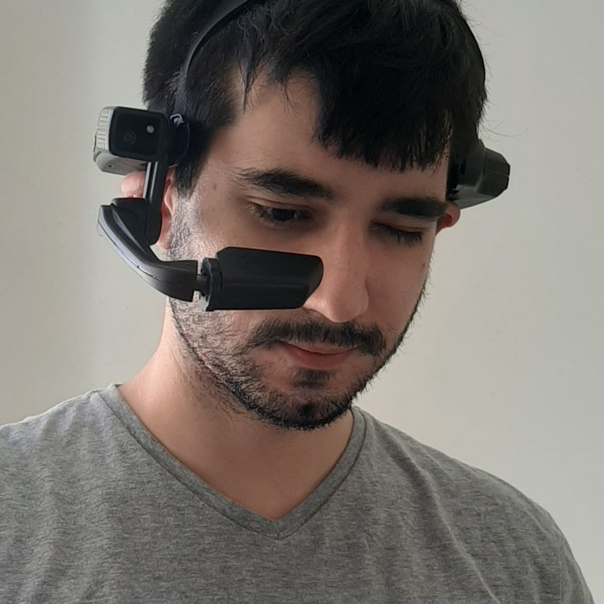

# Copelia

## About the project

Copelia is an augmented reality research and development project for the electrical industry. 

The main goal of that project was to help eletricians identify models of devices called reclosers and check maintenance procedures. The application employed image detection and augmented reality to display animations detailing each procedure. 

## My contributions

- Develop the software using Unity
- Design new features
- Use Android Studios debugging tools to optimize memory and performance
- Integrate Unity with native plugins
- Provide unit tests and coverage reports
- Enhance user experience

## Results

We were able to deliver more features than initially proposed. The project was well-received by the clients and the academia. It resulted in many publications and presentations in events related to Computer Science.

## Media


