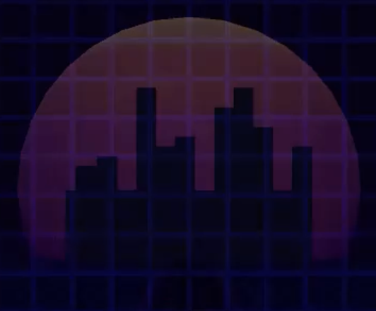

# Tetris Effect Test



## About the project

A simple project I created on my free time inspired by the game design style of [Tetris Effect](https://www.tetriseffect.game/). 

I am a huge fan of [Tetsuya Mizuguchi](https://en.wikipedia.org/wiki/Tetsuya_Mizuguchi), a Japanese game designer who created many games that take immersion to another level.

## My contributions

- Game Design and implementation
- Sound design with third-party music and sound effects
- Creation of visual effects

## Results

I was able to understand Tetris Effect's design philosophy deeper and practice writing shaders with ShaderLab. I took some time to polish the experience compared to other personal experiments. All my friends had fun while playing it, sometimes playing many times to beat their own personal high scores.

## Media

  <video width="75%" controls>
    <source src="https://user-images.githubusercontent.com/2722172/125953156-6fa8d425-d8ee-48ed-b2be-2c6c35b3ed77.mp4" type="video/mp4">
    Your browser does not support the video tag.
  </video>

