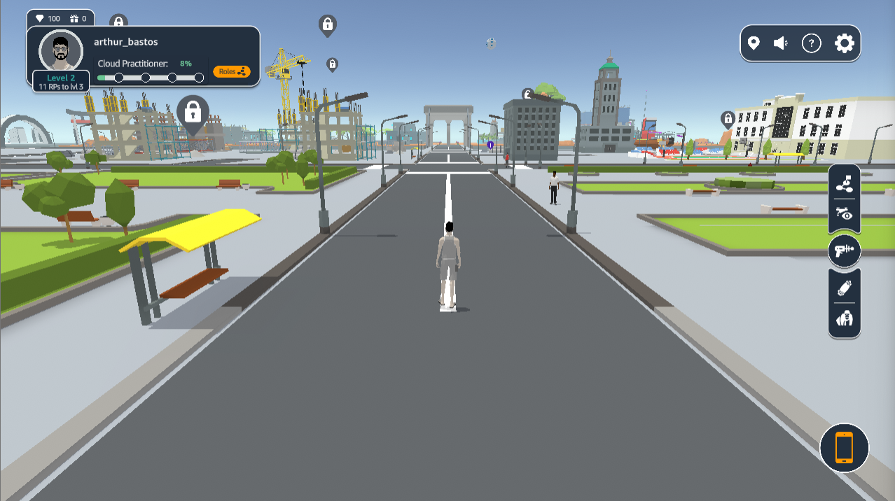

# Cloud Quest



## About the project

Cloud Quest is a gamefied learning experience that teaches players how to use Amazon's cloud computing services to solve real world problems. Each NPC provides a task that must be validated throught AWS Console. The games also offers other gameplay experiences, such as city customization, quizzes, and collectibles.

My most significant contribution was in a major UI/UX revamp in 2022. Check the before & after comparison below:


../images/cq_ui_old.png
../images/cq_ui_new.png



## My contributions

- Develop new features
- Optimize for WebGL
- Design and implement user interfaces and experience
- Create new islands and city customization options
- Localize the game for other languages
- Monitor production metrics

## Results

Cloud Quest quickly became the most accessed and well received <a href="https://explore.skillbuilder.aws/learn">AWS Skill Builder</a> product. It received a major UI/UX revamp and was localized to multiple new languages, including Japanese.

## Media


