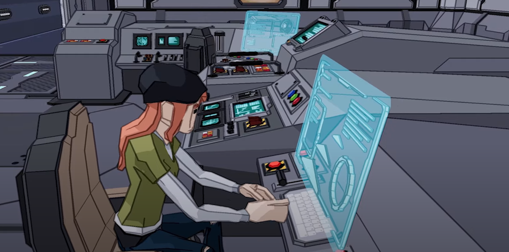

# Escape Room Cloud Practitioner



## About the project

Escape Room is a 2 to 4 hour long experience that helps players achieve a AWS Cloud Practitioner certification through quizzes, puzzles and practical hands-on lab exercises. The game also features event leaderboards and a learning report.

## My contributions

- Design environments for the game's levels
- Design and implement user interfaces and experience
- Optimize for WebGL
- Monitor production metrics

## Results

The game was developed in about 3 months and was showcased at [re:Invent 2023](https://reinvent.awsevents.com/). It was met with overwhelmingly positive reception, which guaranteed new sequels for different AWS Exams.

## Media


../images/EscapeRoom1.png
../images/EscapeRoom2.png
../images/EscapeRoom3.png




