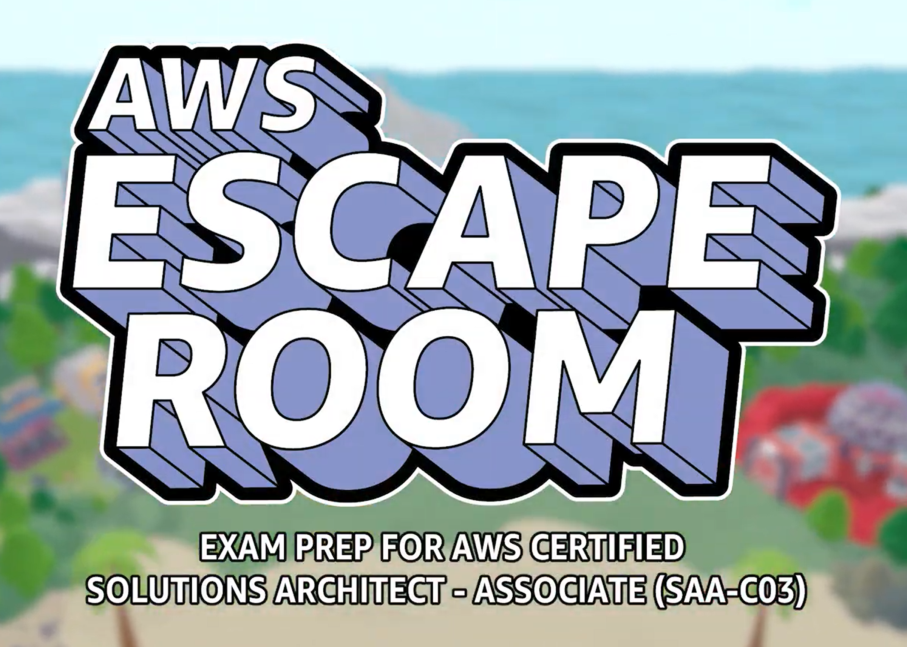

# Escape Room Solutions Architect



## About the project

The game follows the story from [GenAI-themed release](https://arthursb.github.io/projects/2024-escaperoom-fai). This third iteration introduces new features, larger environments and new puzzles to an already established formula.

## My contributions

- Design environments for the game's levels
- Design and implement puzzles
- Create visual effects for new mechanics
- Knowledge share and onboard new team members

## Results

The game was released in August 2025 to provide an engaging way to prepare for the [Solutions Architect Associate](https://aws.amazon.com/certification/certified-solutions-architect-associate/) certification.

## Media


../images/er-saa-game1.png
../images/er-saa-game2.png




