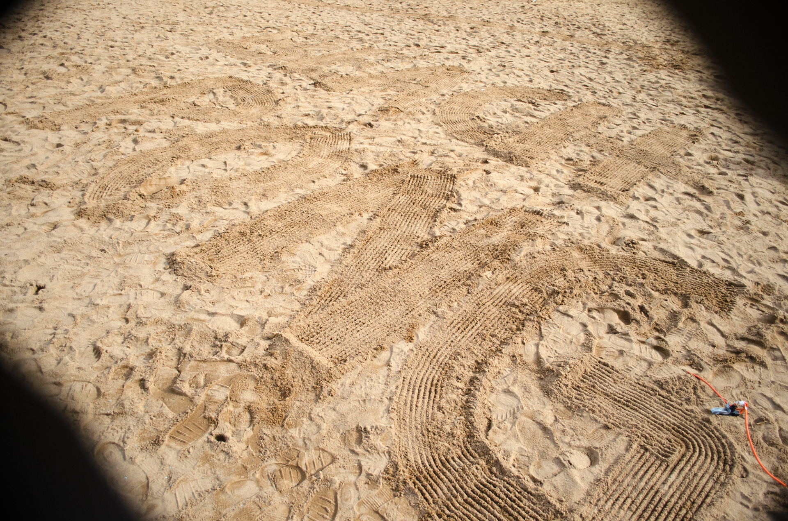
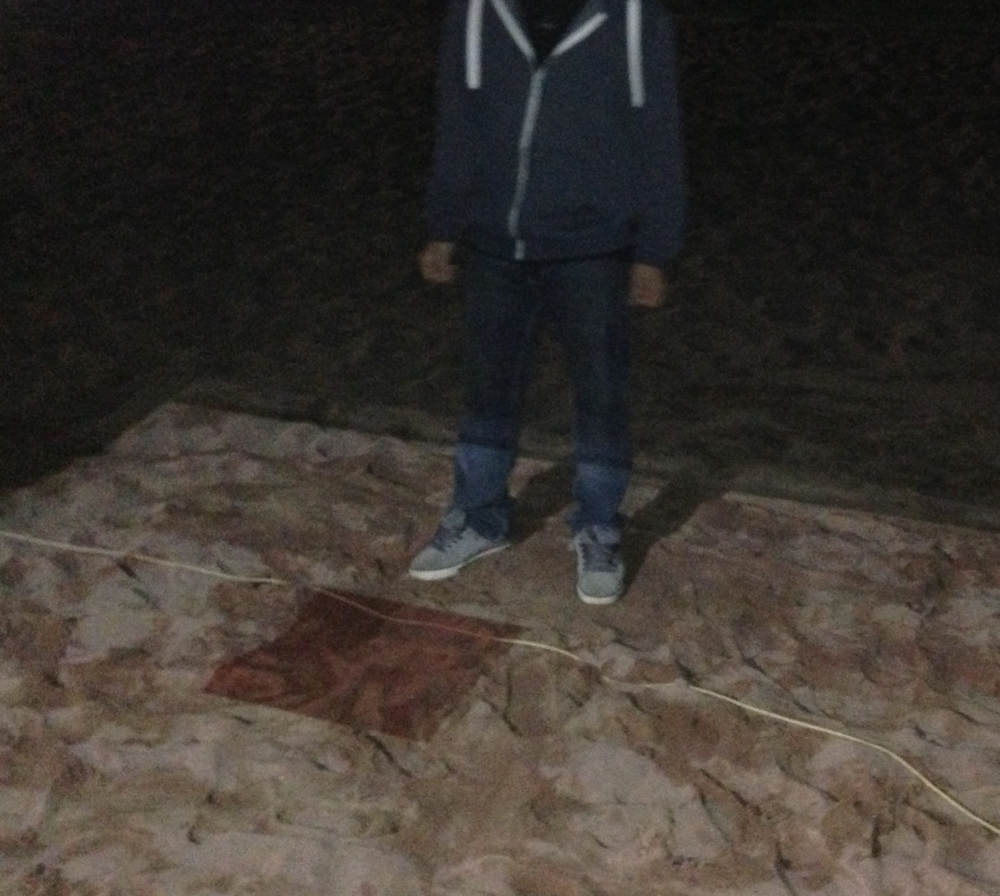
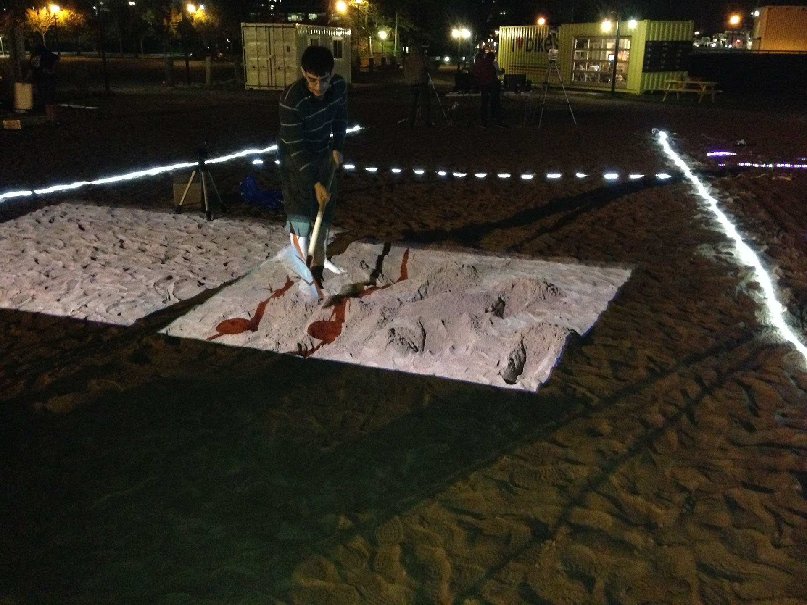
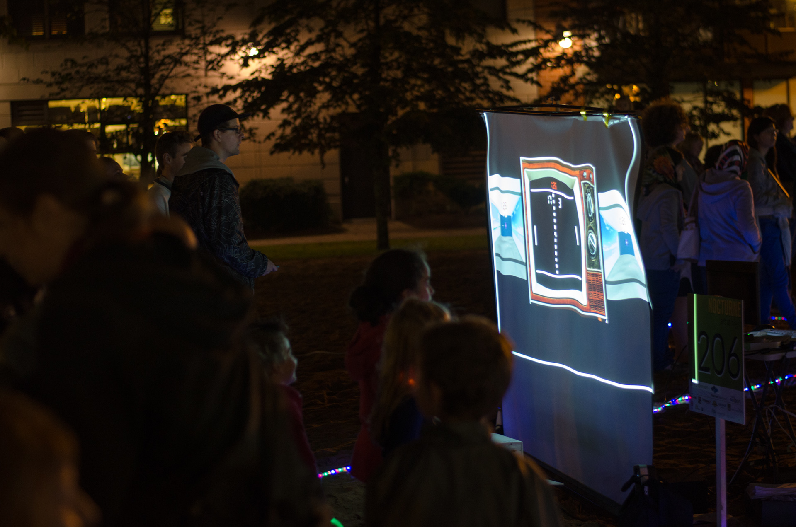
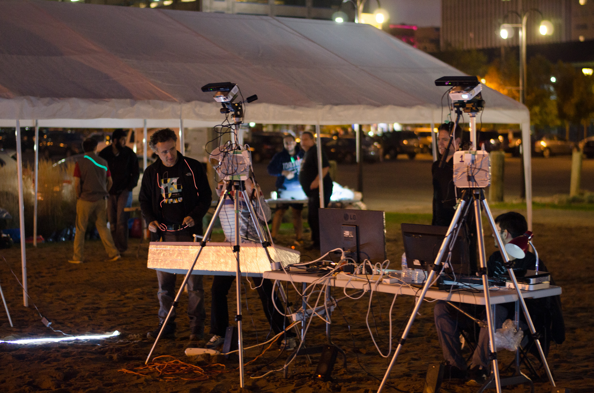
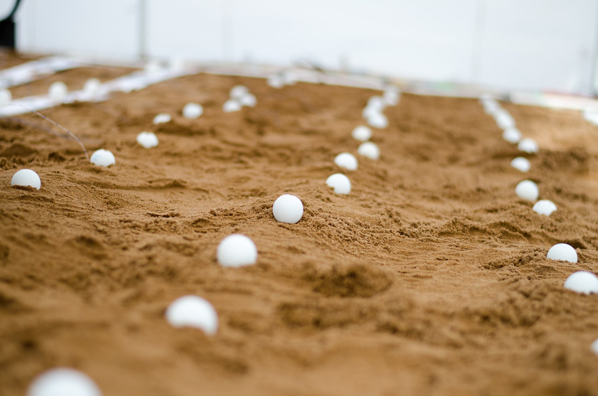
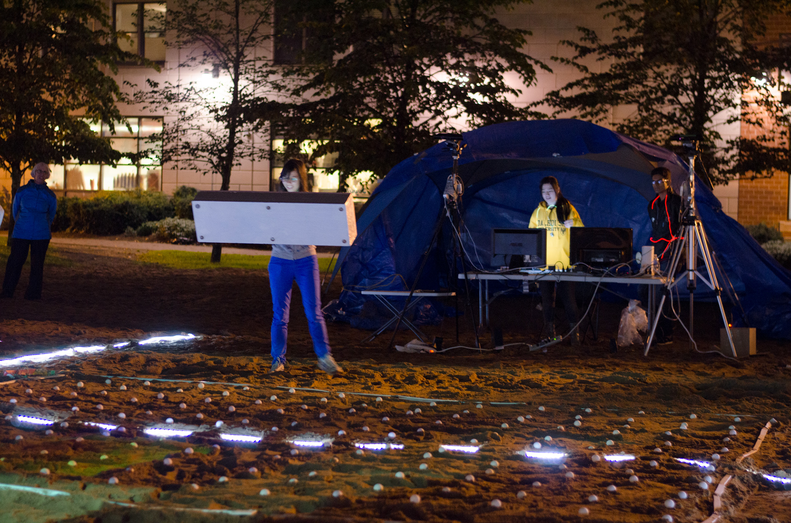
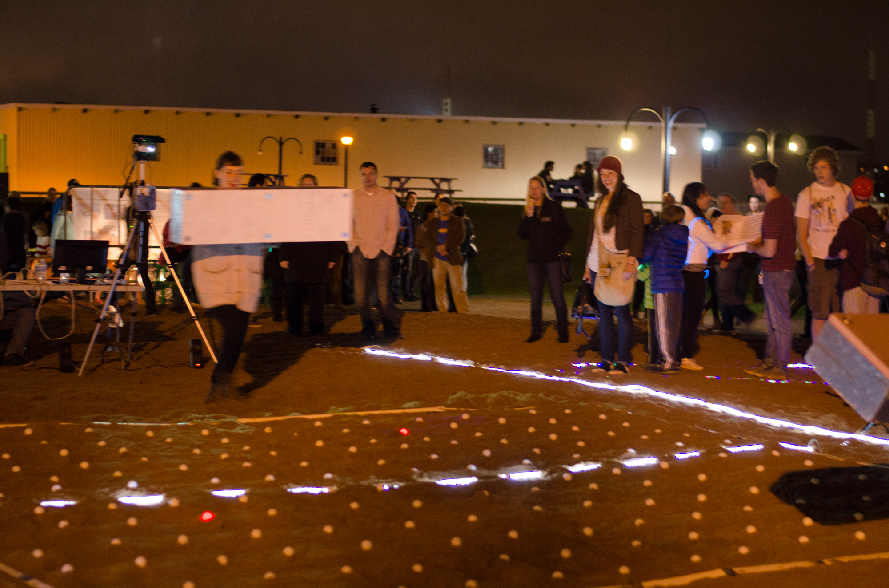

## Beach Pong (2014)

A mixed reality game that redesigns the classic game Pong in 3D. 

Players were set in a sand court and had to physically move around to move the paddle in the virtual world. 
They held a foam paddle equipped with Microsoft Surface tablets so they could see the virtual world in 3D through the paddle's viewport.

The audience could see the virtual environment as a projection in an old VCR screen outside the court.

A grid of LED lights was placed and synced with the game. These lights showed the position of the ball.

While players moved around the court, they caused depressions in the sand. These were detected by the Kinect's depth cameras. 
When that happens, the game creates hazards in the form of lava, which are projected in the sand. 
If a player stays for a long time stepping on it, their game is over.

Beach Pong was exhibited in an art event called [Nocturne](https://nocturnehalifax.ca).

### Official Pages

- [Dr. Reilly's personal page](https://web.cs.dal.ca/~reilly/Nocturne2014.html)
- [GEM Lab's project page](https://gem.cs.dal.ca/projects/beach-pong/)

### Presentation

<iframe src='https://www.youtube.com/embed//T4e8_9a2reU' frameborder='0' allowfullscreen></iframe>

 

### Timelapse

<iframe src='https://www.youtube.com/embed/N46oWSSykbI' frameborder='0' allowfullscreen></iframe>

 

### Setup

### Gameplay

### Reception

- [Dal News](https://www.dal.ca/news/2014/10/16/pong--all-night-long--dal-cs-brings-classic-video-game-to-the-be.html)
- [The Coast](https://www.thecoast.ca/halifax/nocturne-by-the-hour/Content?oid=4438362)
