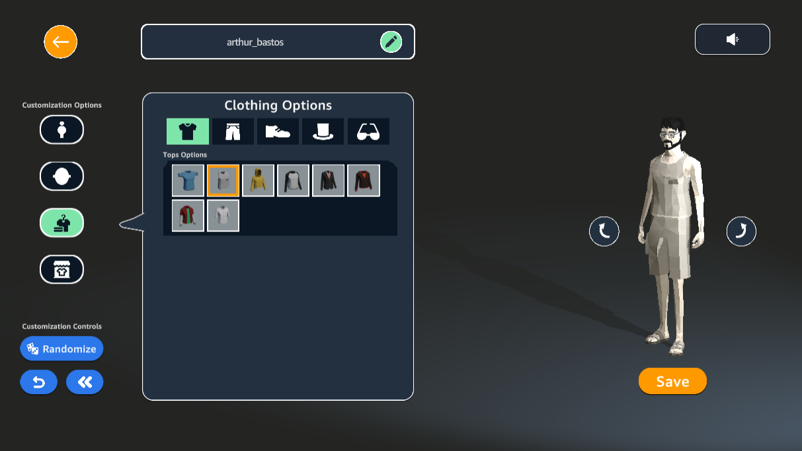
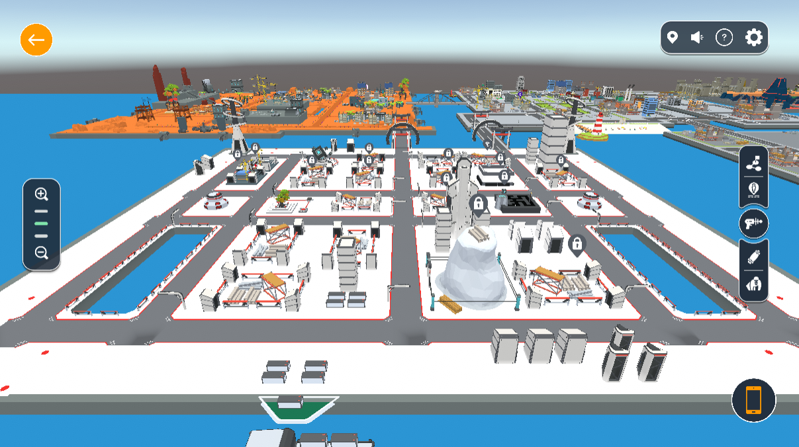
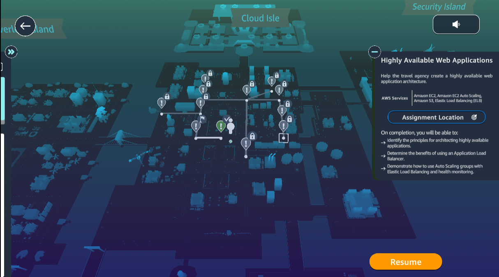
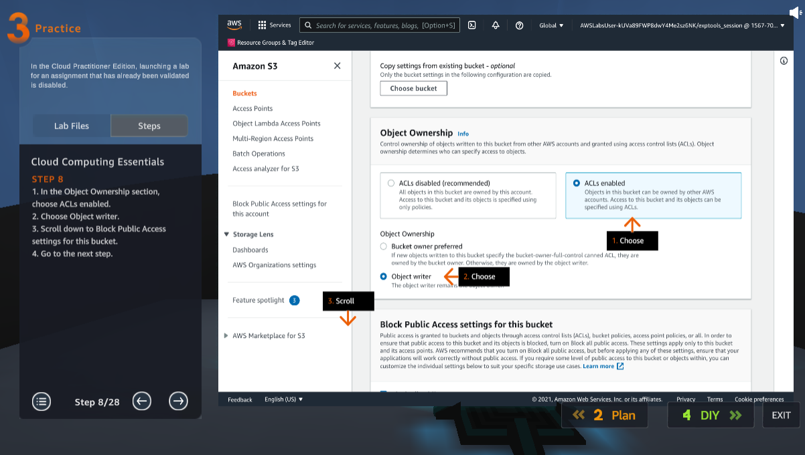

# Cloud Quest

## About the project

Cloud Quest is a gamefied learning experience that teaches players how to use Amazon's cloud computing services to solve real world problems. Each NPC provides a task that must be validated throught AWS Console. The games also offers other gameplay experiences, such as city customization, quizzes, and collectibles.

As a game developer for Cloud Quest, I was tasked to maintain the product, monitor gameplay experience and operational quality, optimize performance, develop city customizations options, and more. I contributted the most in the UI/UX of the game, leading a major UI revamp.

Cloud Quest quickly became one of the most accessed and well received <a href="https://explore.skillbuilder.aws/learn">AWS Skill Builder</a> products. You can check the game <a href="https://cloudquest.skillbuilder.aws/">here</a>.

## References
- [CNBC](https://www.cnbc.com/2022/03/15/amazon-launches-metaverse-like-game-to-train-people-how-to-use-aws.html)
- [The Channel Company](https://www.crn.com/news/cloud/amazon-launches-metaverse-type-game-for-aws-cloud-training)
- [Le Monde Informatique](https://www.lemondeinformatique.fr/actualites/lire-aws-lance-cloud-quest-un-jeu-de-role-pour-acquerir-des-competences-cloud-86146.html)

(P.s.: despite what many media outlets say, Cloud Quest has nothing to do with metaverse...)

## Media

<iframe src='https://www.youtube.com/embed/lcmVvIeiFGc' frameborder='0' allowfullscreen></iframe>

 

     

          
     

     

          
     

     

          
     

     

          
     

