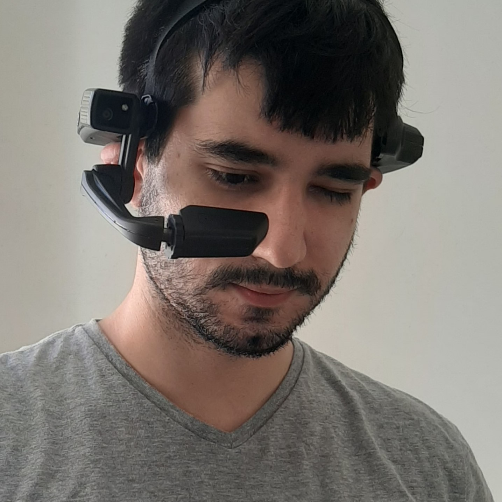

# Copelia

## About the project

I worked in an augmented reality research and development project for the electrical industry. 

The main goal of that project was to help eletricians identify models of devices called reclosers and check maintenance procedures. The application employed image detection and augmented reality to display animations detailing each procedure.

It was a very challenging project. I learned about optimizing graphics for mobile hardware, debugging memory-related issues, using Android Studios performance tools, writing or utilizing native plugins, and more. It was also the first time I was required to write automated tests to generate code coverage reports for auditing purposes. 

We were able to deliver more features than initially proposed. The project was well-received by the clients and the academia. It resulted in many publications and presentations in events related to Computer Science. 

## Media

<iframe src='https://www.youtube.com/embed/IoXETt0E-Ok?start=103' frameborder='0' allowfullscreen></iframe>

