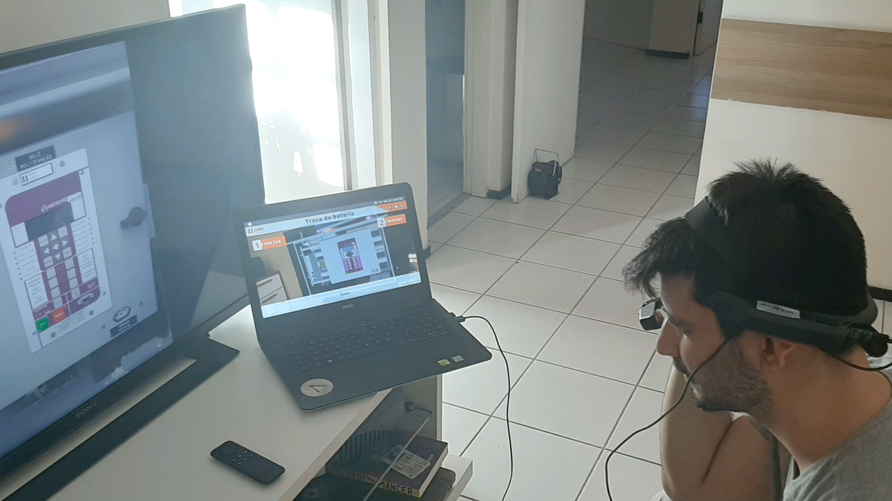
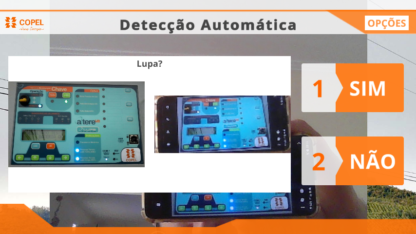
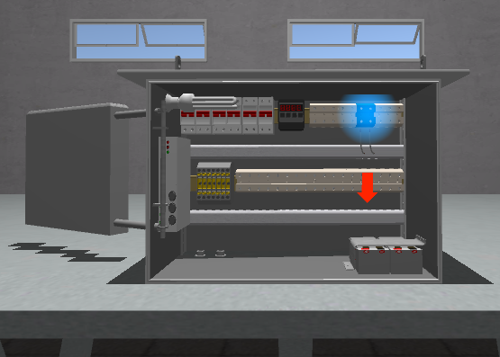

# Copelia

## About the project

Copelia is an augmented reality application developed in Unity for the Realwear HMT-1, a hands-free smart glass. Its main goal is to provide support for electricians who might need to repair certain electronic devices. Copelia provides step-by-step maintenance instructions, each one illustrated by animated 3D models of virtual replicas of the supported devices. Besides augmented reality, Copelia also features object detection, remote calls, access to documentation, and video instructions.

I worked as the main programmer of the application itself. It was a very challenging project. I learned about optimizing graphics for mobile hardware, debugging memory-related issues, using Android Studios performance tools, writing or utilizing native plugins, and more. It was also the first time I was required to write automated tests to generate code coverage reports for auditing purposes. Besides the challenges related to software development, I also mentored an intern who aimed to grow as a 3D software developer. 

## Media

<iframe src='https://www.youtube.com/embed/IoXETt0E-Ok?start=103' frameborder='0' allowfullscreen></iframe>

 

