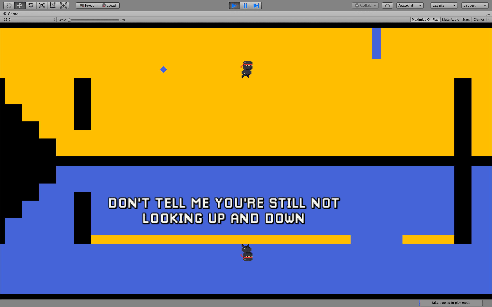
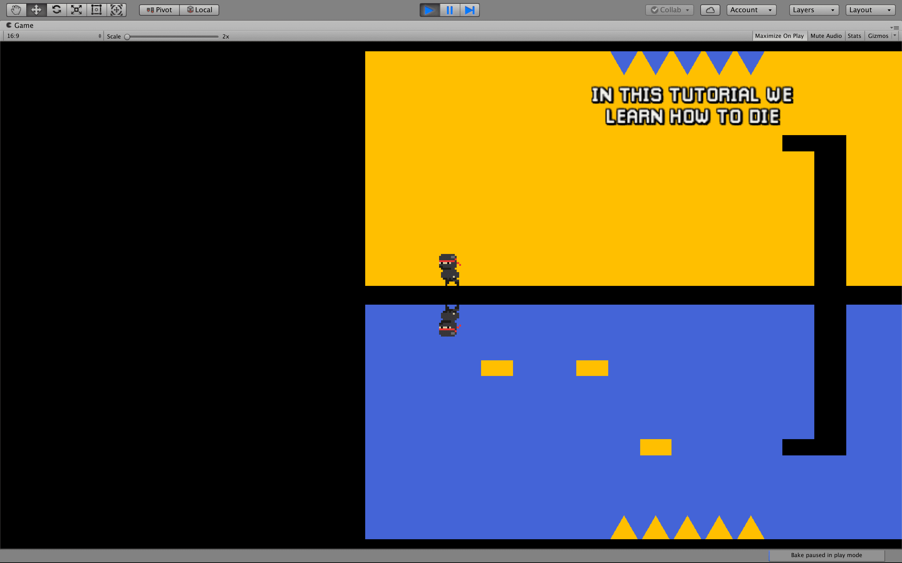
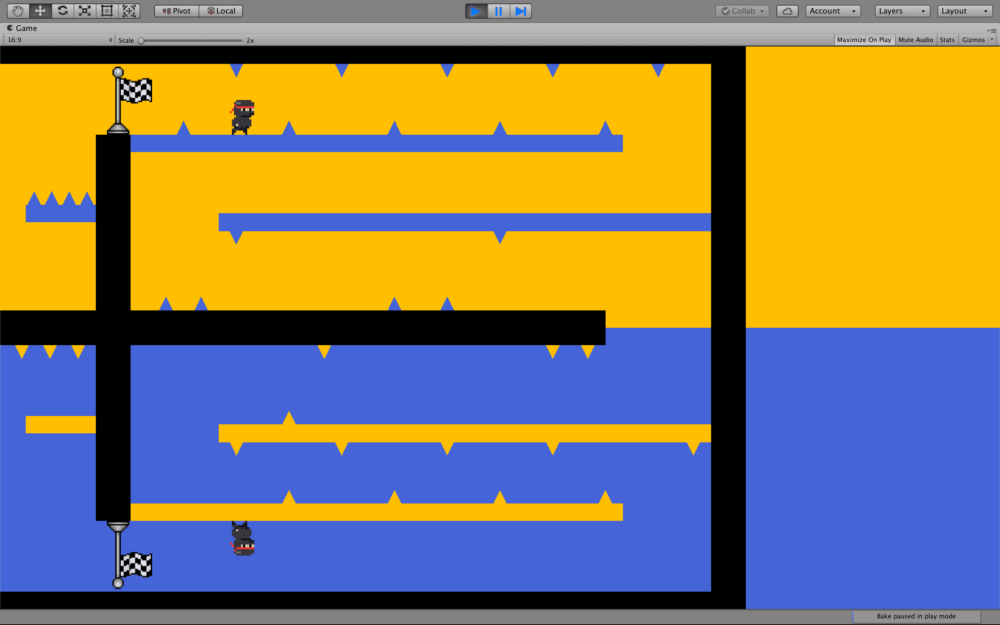

# Downside Up

## About the project

Downside Up was my Master's degree research project. I studied how data visualization supports level design.

The game is a hardcore 2D platformer in which players must guide a character through two mirrored screens. Objects may appear in only one of those screens, besides existing in both, so players must use their gaze to understand and overcome challenges. We improved this prototype using GUR methods and Data Visualization.

In this project I learned about designing games based on analytics. You can check more details about the research in the [project's page on Github](https://arthursb.github.io/Downside-Up/). The game is also available online [here](https://arthursb.github.io/Downside-Up/#gameOverview).

## Media

<iframe src='https://www.youtube.com/embed/glwUdien5fs' frameborder='0' allowfullscreen></iframe>

 

     

          
     

     

          
     

     

          
     

     

          
     

