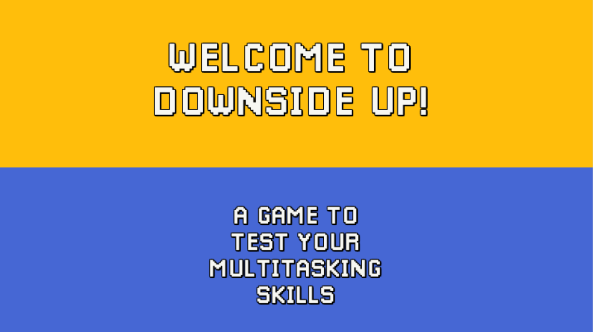

## Downside Up

Downside Up is a hardcore 2D platform game in which players must guide a character through two mirrored screens. 
Objects may appear in only one of those screens, besides existing in both, so players must use their gaze to understand and overcome challenges.
We improved this prototype using GUR methods and Data Visualization.

### Official Page

- [Project Page on Github](https://arthursb.github.io/Downside-Up/)

### Play the Game

- [Browser Demos](https://arthursb.github.io/Downside-Up/#gameOverview)

### Screenshots

