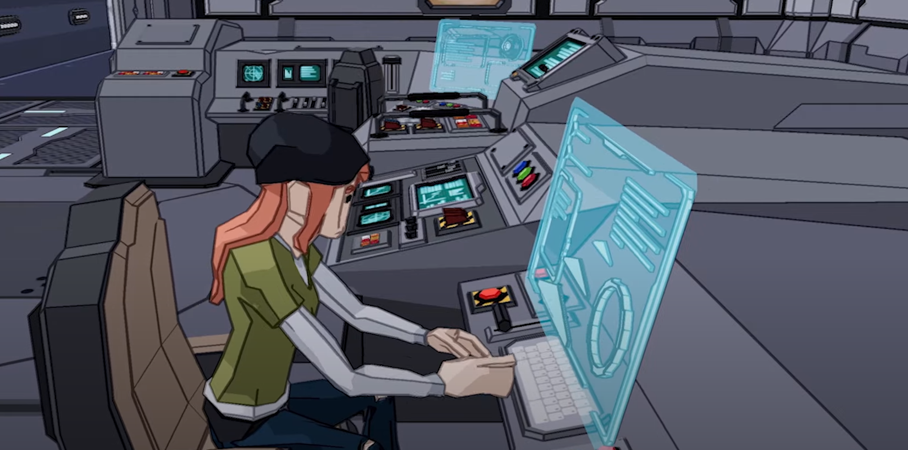
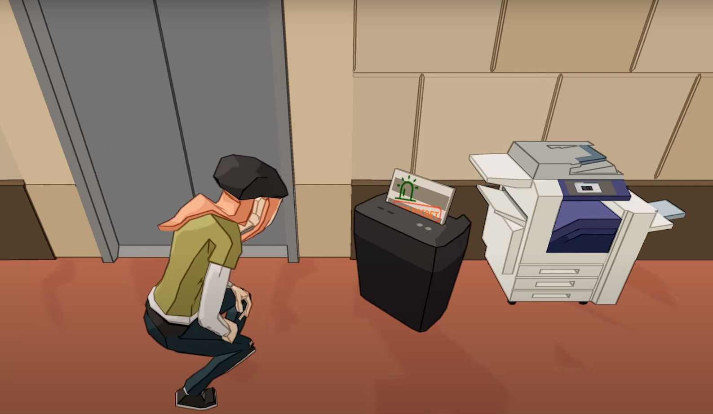
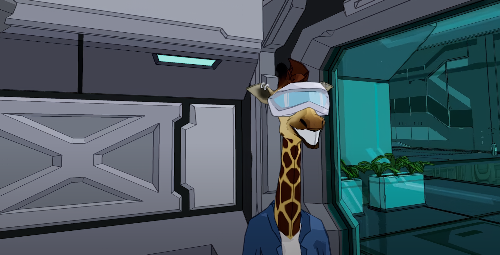
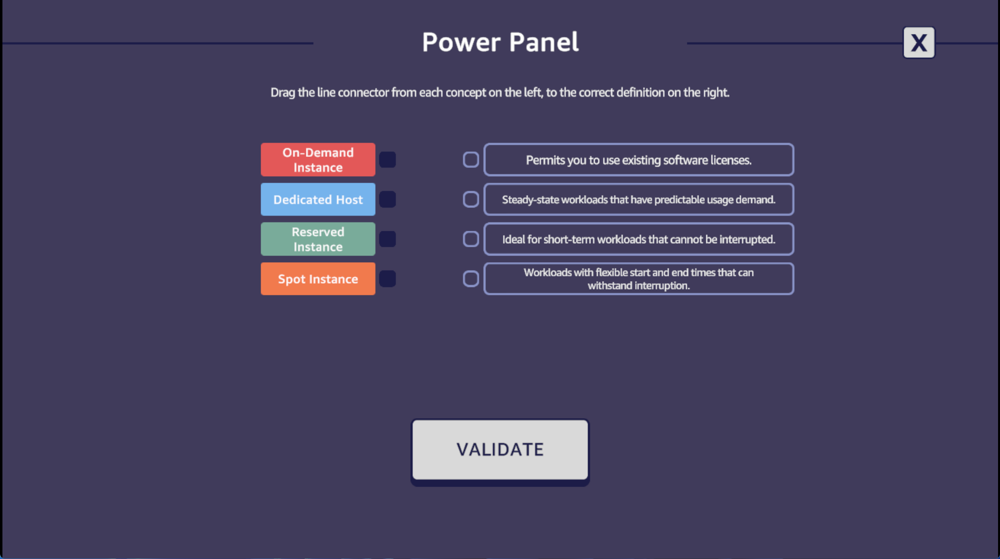

# Escape Room

## About the project

AWS Escape Room tells the story of an unnamed IT worker of a toothbrush company that takes their friend Cloudia to a tour. Cloudia somehow breaks the company's servers and is arrested by a guard. It is up to the player to save her and uncover the mystery behind the company.

It is a 2 to 4 hour long experience that helps players achieve a AWS Cloud Practitioner certification through quizzes, puzzles and practical hands-on lab exercises. The game also features event leaderboards and a learning report.

The game was developed in about 3 months and was showcased at [re:Invent 2023](https://reinvent.awsevents.com/). It was a very challenging project that required multiples expertises beyond programming. 

I led the planning of the project, worked on enviromental design and cutscenes of the final two levels, programmed the quizzes and puzzles, and supervised the UI/UX experience. I also contributed to the the game design and look & feel. 

It was also the first project where, Cloudia, the giraffe mascot I created for Cloud Quest, came to life as it own character! You can check AWS Escape Room at [Skill Builder](https://explore.skillbuilder.aws/learn/course/external/view/elearning/17373/aws-escape-room-exam-prep-for-aws-certified-cloud).

## Media

<iframe src='https://www.youtube.com/embed/DI8Z12LLMck' frameborder='0' allowfullscreen></iframe>

 

     

          
     

     

          
     

     

          
     

