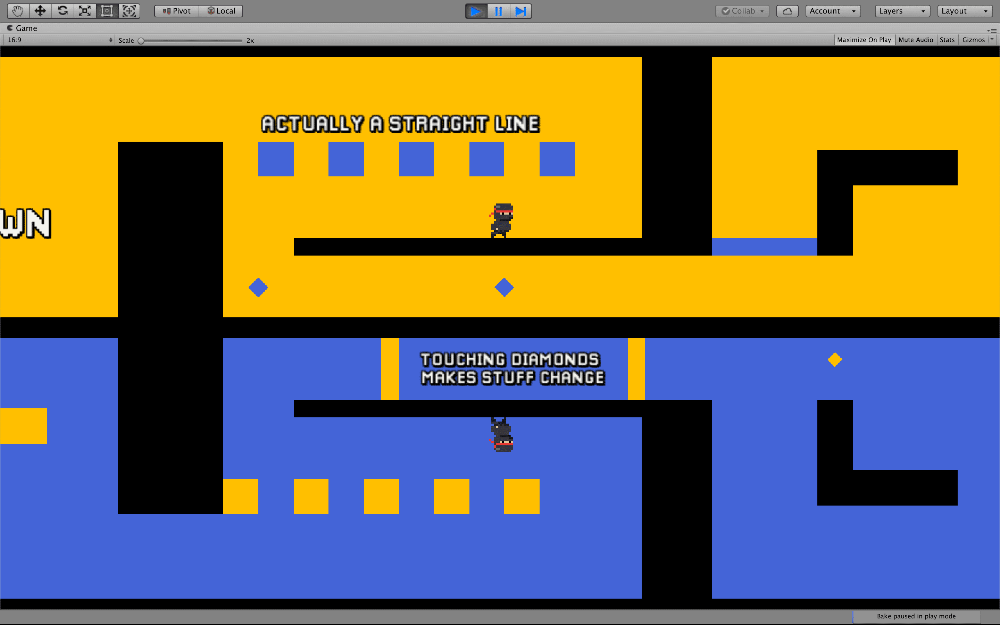
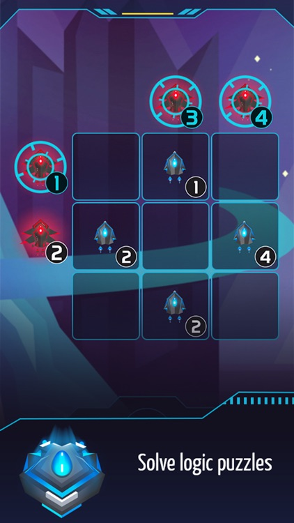
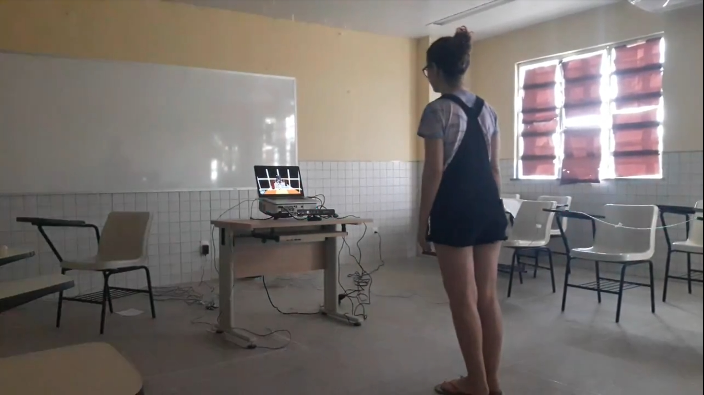
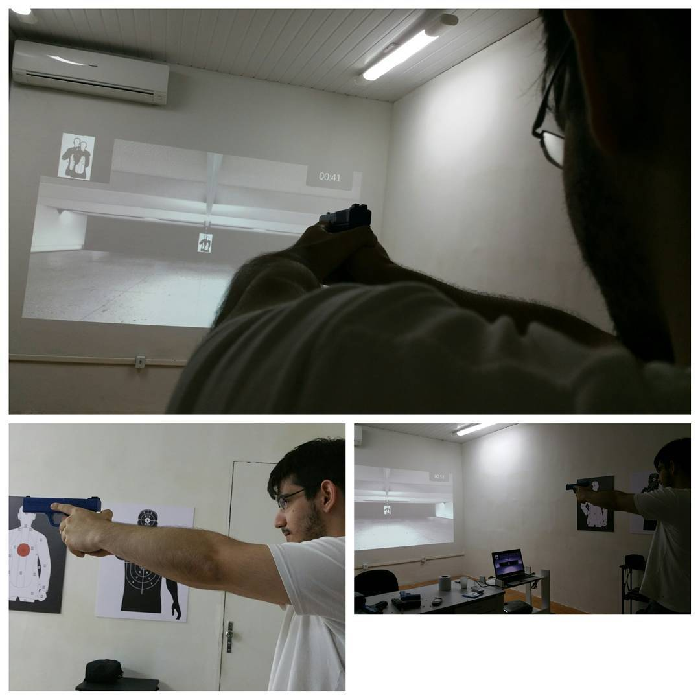
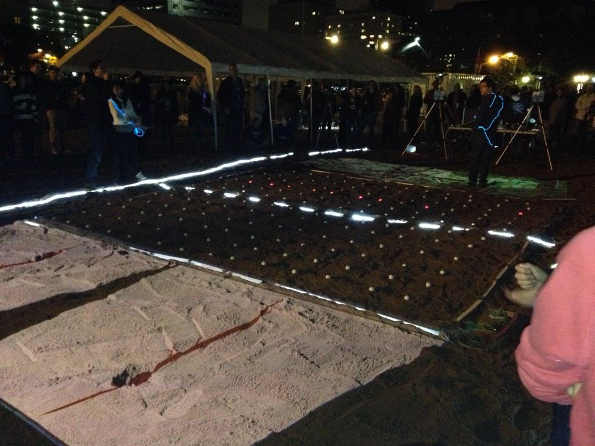

## Portfolio

---

### 2D Games With Unity

[Downside Up (2019)](https://arthursb.github.io/Downside-Up/)

---

[2001: Space Puzzle (2016)](/2001.md)

---

### Mixed Reality

[Synesthesia (2016)](/synesthesia.md)

---

[XTREME SHOOTING SIMULATOR (2015)](http://example.com/)

---

[Beach Pong (2014)](http://example.com/)

---

### Research

- [Evaluating the Use of Affordable User Testing and Visualization Techniques in Level Design of a Hardcore 2D Platform Game](https://www.sbgames.org/sbgames2019/files/papers/ArtesDesignFull/197031.pdf)
- [Assessing the Experience of Immersion in Electronic Games](https://ieeexplore.ieee.org/abstract/document/8114431)
- [Doing While Thinking: Physical and Cognitive Engagement and Immersion in Mixed Reality Games](https://dl.acm.org/doi/abs/10.1145/2901790.2901864)
- [A Perceptual Depth Shape-based CRF Model for Deformable Surface Labeling](https://ieeexplore.ieee.org/abstract/document/7158338)

---
