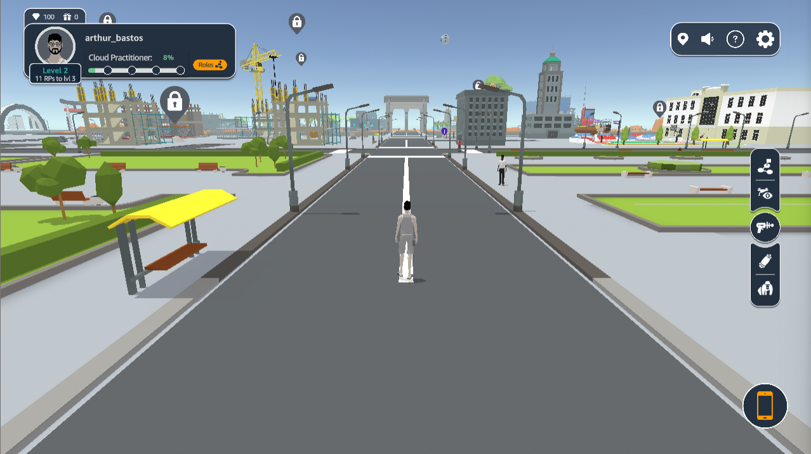
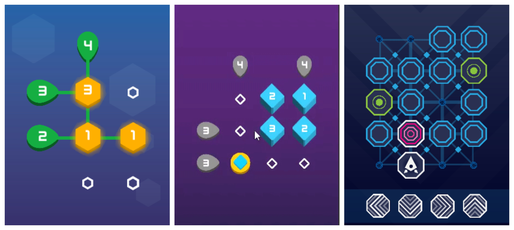
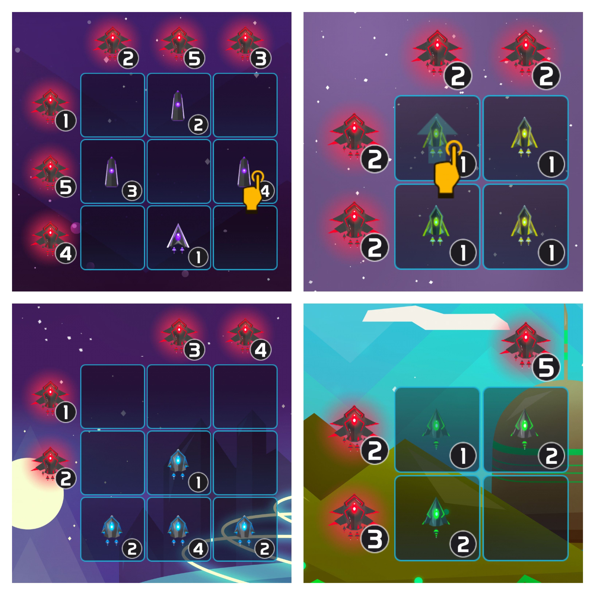

<h1>Portfolio</h1>

<a href = "/copelia.html">
<h2>Cloud Quest (2021)</h2>
<h4>AWS Training & Certification</h4>
</a>
<h5>Game Based Learning, Front End Development</h5>
 

<a href = "/copelia.html">
<h2>Copelia (2020)</h2>
<h4>Instituto Atlântico</h4>
</a>
<h5>Augmented Reality (AR), UX Research</h5>
 

<a href = "/downsideup.html">
<h2>Downside Up (2019)</h2>
<h4>Universidade Federal do Ceará</h4>
</a>
<h5>Games User Research, Game Development</h5>
 

<a href = "/puzzles.html">
<h2>Sumset Classic, Sumset Slider and Hexago (2017)</h2>
<h4>Advance Comunicação</h4>
</a>
<h5>Game Development</h5>
 

<a href = "/2001.html">
<h2>2001: Space Puzzle (2016)</h2>
<h4>Advance Comunicação</h4>
</a>
<h5>Game Development</h5>
 

<a href = "/synesthesia.html">
<h2>Synesthesia (2016)</h2>
<h4>Universidade Federal do Ceará</h4>
</a>
<h5>Mixed Reality (MR), Multimedia Installation, Game Development</h5>
 

<a href = "/xss.html">
<h2>XTREME SHOOTING SIMULATOR (2015)</h2>
<h4>Crearetech</h4>
</a>
<h5>Mixed Reality (MR)</h5>
 

<a href = "/beachpong.html">
<h2>Beach Pong (2014)</h2>
<h4>Dalhousie University</h4>
</a>
<h5>Mixed Reality (MR), Multimedia Installation, Multiplayer</h5>
 

