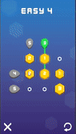
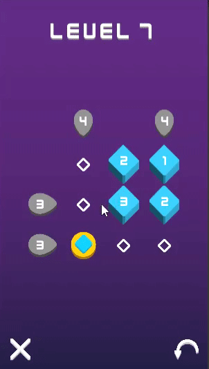

# Advance Games

## About the project

A series of short, casual, free minimalistic puzzle games with clever mechanics.

### SumSet (Classic)

Move the heaxagons to an empty space or swap the position of two hexagons. Align the hexagons so all values match the rows and columns.

You can play SumSet Classic online [here](https://arthursb.github.io/advance-games/Classic/index.html).

### SumSet (Slider)

Slide the circle or click the heaxagons to swap positions. Align the hexagons so all values match the rows and columns.

You can play SumSet Slider online [here](https://arthursb.github.io/advance-games/Slider/index.html).

### TraceRT

Create a path using the arrows to collect all items and lead the spaceship to the goal.

You can play TraceRT online [here](https://arthursb.github.io/advance-games/TraceRT/index.html).

## Credits

Arthur Bastos (Programming)

Evandro Sorensen (Puzzle Design)

Guilherme Pedrosa (Visuals)

JP Martins (Visuals)

Luan Lucas (Sound)
