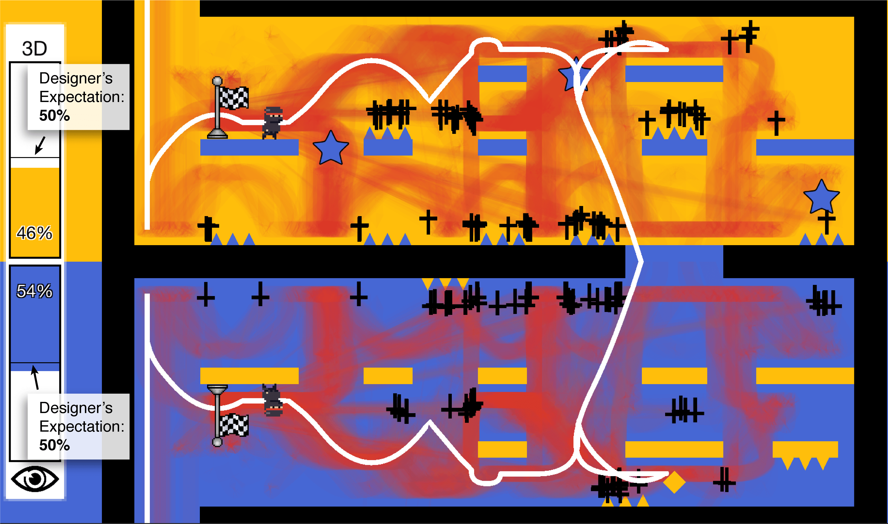
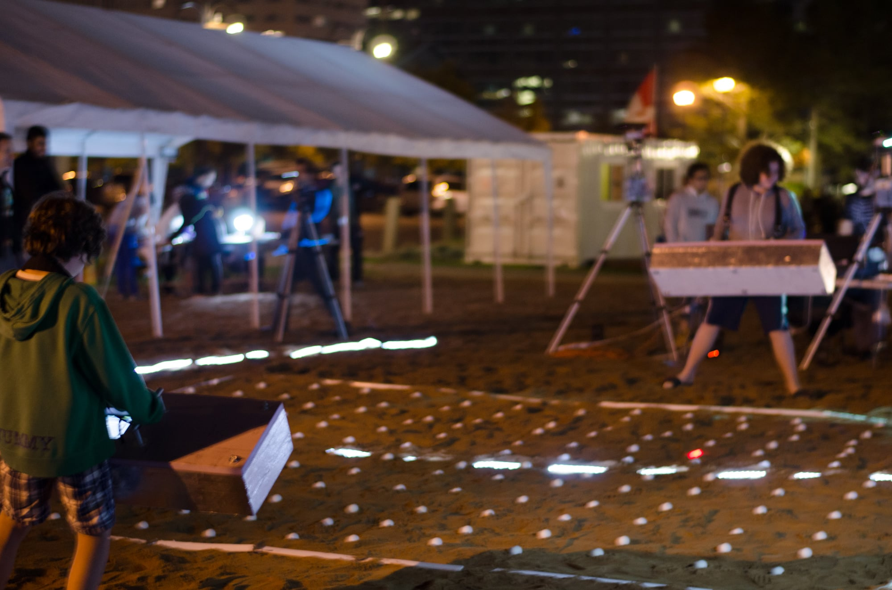
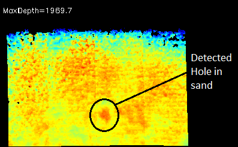

# Research

[Evaluating the Use of Affordable User Testing and Visualization Techniques in Level Design of a Hardcore 2D Platform Game (2019)](https://www.sbgames.org/sbgames2019/files/papers/ArtesDesignFull/197031.pdf)

---

[Assessing the Experience of Immersion in Electronic Games (2017)](https://ieeexplore.ieee.org/abstract/document/8114431)

---

[Doing While Thinking: Physical and Cognitive Engagement and Immersion in Mixed Reality Games (2016)](https://dl.acm.org/doi/abs/10.1145/2901790.2901864)

---

[A Perceptual Depth Shape-based CRF Model for Deformable Surface Labeling (2015)](https://ieeexplore.ieee.org/abstract/document/7158338)

