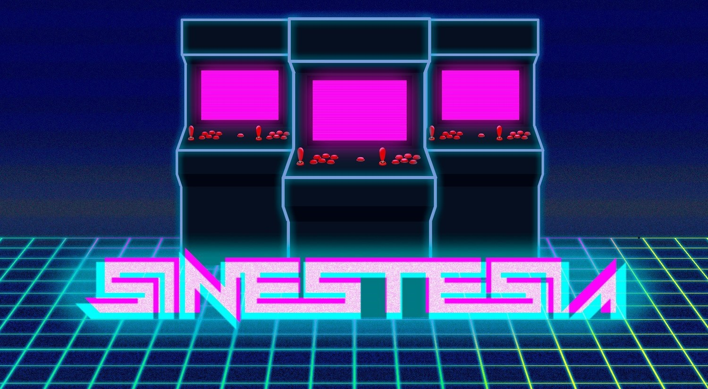
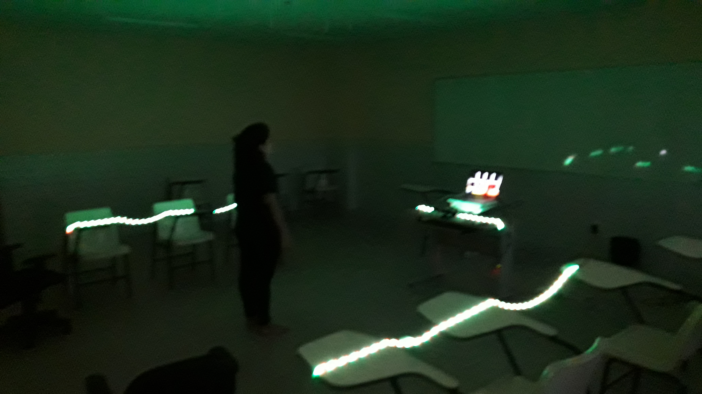

# Synesthesia

Prototype of an immersive mixed reality game. 
The Kinect tracks when players move left and right, jump or crouch to control a virtual character accordingly. 
The main goal is to avoid obstacles, just like in a runner game.
We set LED stripes to help players localize themselves in the real world and have a better notion of the camera tracking limits.
These lights were synchronized with the game. Through beat detection, we could make the lights blink and change color to the music.
This ambience created an 80's arcade feeling.

## Setup

<iframe src='https://www.youtube.com/embed//T4e8_9a2reU' frameborder='0' allowfullscreen></iframe>

 

## Gameplay

<iframe src='https://www.youtube.com/embed//9KPFe5mHrTE' frameborder='0' allowfullscreen></iframe>

 

## Reception

The research was given a [Best Paper Award](http://usuarios.upf.br/~rieder/svr2017/awards.html) in 2017.
