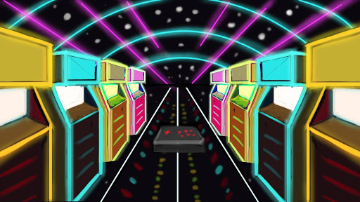
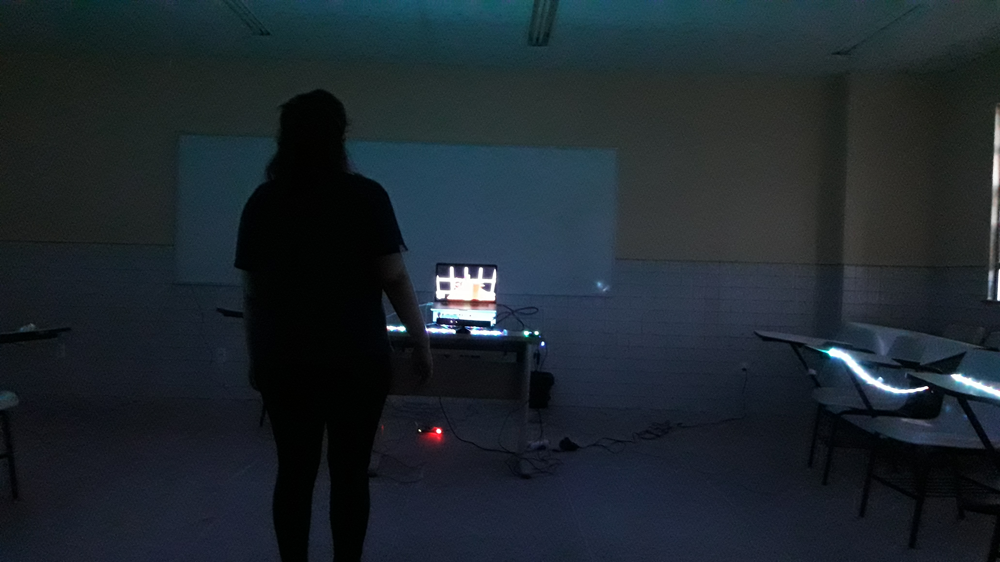

# Synesthesia

## About the project

A game I developed as my final project to achieve my Bachelor's degree.

It is a mixed reality runner game. Players can move left and right, jump and crouch in the real world to make the avatar do the same in the virtual world. 

The main goal is to reach the end of all three levels while avoiding obstacles. 

The game was set up in a way to make the experience more immersive. LED strips defined the Kinect's range limits and helped players localized themselves better in the real world. The obstacles in-game were synchronized to the music. The LEDs blinked and changed colors to the soundtrack using beat detection. 

I was responsible for the game design and coding of Synesthesia. In this project, I learned about using serial communication to connect Unity and Arduino. I also learned about managing teams.

I wrote a paper about immersion in games comparing Synesthesia with two other commercial games. The research won a [Best Paper Award](http://usuarios.upf.br/~rieder/svr2017/awards.html) in 2017.

## Media

<iframe src='https://youtu.be/vNqGImMW_KE' frameborder='0' allowfullscreen></iframe>

 

<iframe src='https://youtu.be/7-gkkgADoXg' frameborder='0' allowfullscreen></iframe>

 

