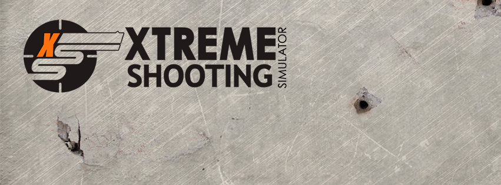
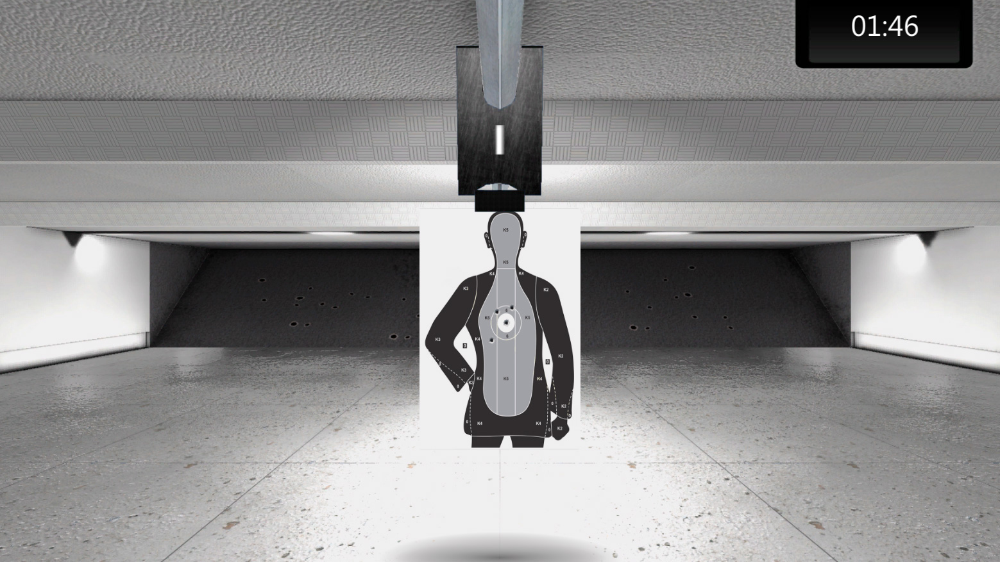
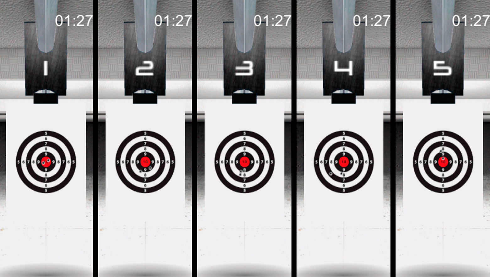
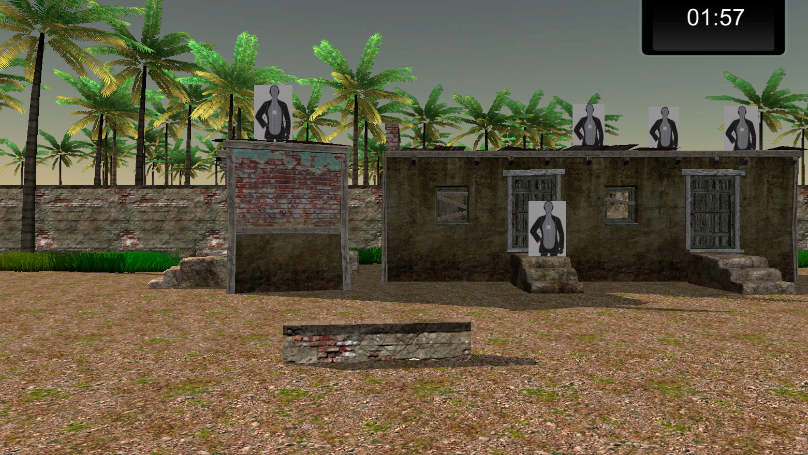

## XTREME SHOOTING SIMULATOR (2016)

A budget shooting simulator designed for training the local police. 
It employs the PS Eye camera with a red filter to detect lasers fired by custom 3D-printed “bullets".
The bullets were used with airsoft guns.

### Official Pages

- [Crearetech on Facebook](https://www.facebook.com/crearetech/)
- [XSS on Facebook](https://www.facebook.com/xssimulator/)

### Showcase

### Screenshots

### Reception

Links below are in Portuguese, as the game was marketed for a local audience.

- [Eusebio's Official Website](http://eusebio.ce.gov.br/guarda-municipal-e-a-primeira-do-pais-a-utilizar-o-simulador-xtreme-nos-treinamentos/)
- [Maracanau's Official Website](https://www.maracanau.ce.gov.br/guarda-municipal-de-maracanau-utiliza-simulador-de-tiro/)
